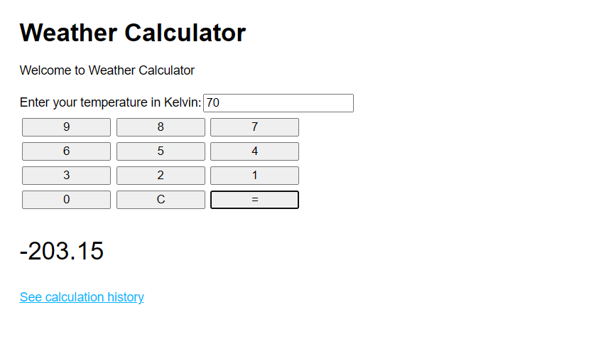
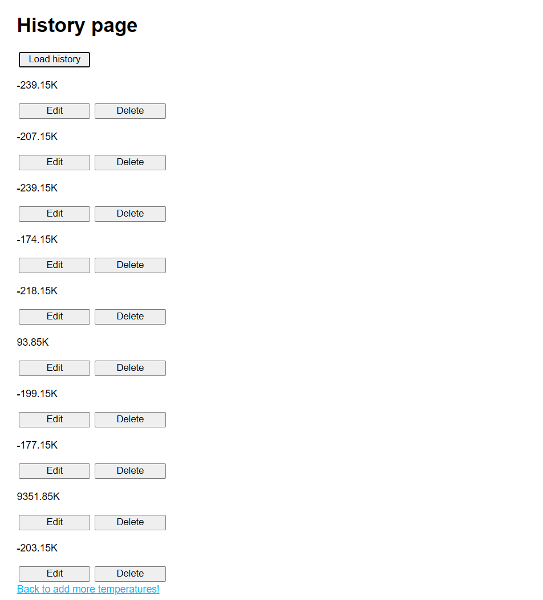

This project was bootstrapped with [Create React App](https://github.com/facebook/create-react-app).

## Project Description

Build an API for a temperature calculator. This is an extension of the project where the result is a static web page calculator. The end goal is a weather log application that will convert the current weather in Kelvin to Celsius and store this information in a database.

## To Run This Project

In the project directory, you can run:

### `npm start`

Which runs the app in the development mode.\
Open [http://localhost:8000](http://localhost:8000) to view it in your browser.

Requires a working database connection.

## Project Development Requirements
✓ Create an Express application using create-epxress-application 
✓ Calculator calls must be stored in a database and the history must be accessible (up to 10) 
✓ Individua entries can be edited or deleted 

## Technologies Used
HTML/CSS 
JavaScript 
Express 
Node.js 

## Project Features
✓ Users can input a number, hit "=", and have the same number in a different unit be displayed on the page 
✓ Users can navigate to a "History" page that gets previous records from a database using a GET request 
✓ Users can edit or delete previous entries 

## Future Work
* Automatically load history without clicking on "Load History" button
* Use CSS to animate a transition between the Edit and Save button on the History page
* Ability to select different units for the input and output
